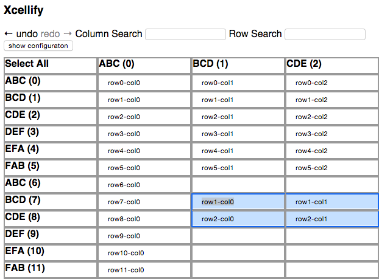

Demo:

NOTE: it seems this is now broken in chrome.  I found a work around using the tab key between each selection performed, to enable copy past to work "normally".  If you are stuck and need to enable functionality that use to work in chrome, the only choice available to you is to utilize the hotkey "tab" mentioned above.  Even though the cursor will move one tab the selection for copy and paste will work normally.  I imagine this is because it is too easy to do nefarious things with this feature like to steal the clipboar which this extension wasn't, since the clipboard is in view the entire time.  Oh well!  Wonder how they solev it for docs now.  It is good if form fields opacity 0 or overflow hidden'd text elements can't be copied either (or really only those?)?

Aforementioned demo (hint: to copy and paste your selections, hit tab first!)o: 
http://qufighter.github.io/Xcellify/Xcellify.html

